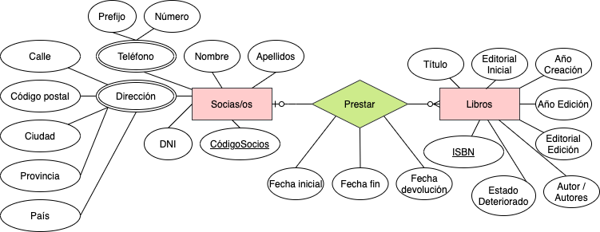
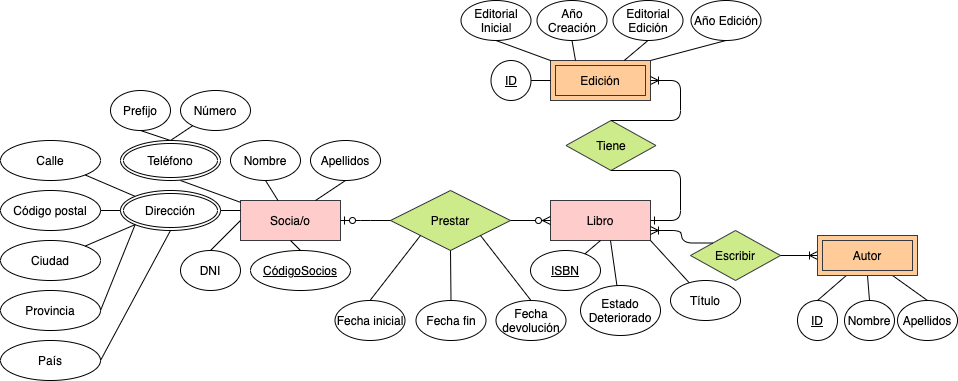

# ER Diagrama para biblioteca

Para esta práctica he decidido presentar dos diagramas, porque he pensado que ambas opciones serían válidas en función de lo compleja y escalable que se quiera hacer la base de datos.

## Biblioteca version simplificada

La versión simplificada como se puede apreciar solo incluye dos entidades principales y una tabla intermedia con la relación entre ambas entidades para hacer un control de los préstamos.

- Socias/os: Tiene como clave primaria el código del socio, todos los atributos solicitados en la descripción y dos de ellos son complejos. Por ejemplo: Dirección que se subdivide en todos los campos que puede incluir: calle, código postal, ciudad, provincia y país.

- Libros: Tiene como clave primaria el código del libro (ISBN) y el resto de atributos a un único nivel.

- Préstamos: Es la tabla intermedia que representa la relación entre ambas entidades, donde encontramos tres atributos: Fecha inicial y Fecha fin y Fecha devolución. He decidido dejar la fecha fin como un atributo independiente porque aunque se puede calcular con 15 días en adelante con la fecha inicial, puede ser que con el tiempo las condiciones de tiempo varien y no podemos condicionar el modelo de la base de datos a algo efímero.

## Biblioteca versión compleja

Esta versión del diagrama es más compleja pero creo que es interesante porque permite una mayor escalabilidad de la base datos en el caso de querer hacer posteriormente un mayor control de los libros que pueden tener diferentes ediciones pero están bajo el mismo nombre.

Y lo mismo con los autores, al ser una entidad débil, depende totalmente de que tenga al menos un libro asociado. Y no tendría sentido tener por libre una tabla de Autores si éstos no estuvieran asociados al menos a un libro.

## Conclusión:

Yo personalmente me decantaría por utilizar el modelo de diagrama con la versión compleja, porque considero que aporta más valor a la hora de permitir un mayor control de los autores y ediciones. Y con un buen número de registros, se podrían facilitar muchísimo las consultas a esta base de datos por autores o ediciones.
